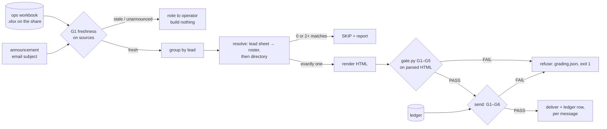

# fanout-gate

[](https://github.com/jbisaccia-9/fanout-gate/actions/workflows/ci.yml)

**One ops workbook → one private KPI message per lead — and the gate that refuses to send any of them stale, misaddressed, leaking, paraphrased, or twice.**

The workflow is ordinary: operations publishes a weekly workbook, and every
site lead should get a direct message with their own portfolio — this week's
numbers, month-to-date, the hours needed to close each gap, and the action
items ops already wrote for each site. The manual version is a relay chain, so
it arrives late, in six formats, or not at all. The automated version is a
loop with a `send()` in it, and every way that loop goes wrong is quiet: last
week's file goes out because this week's wasn't up yet; a name matches two
people in the directory and the first hit gets someone else's portfolio; a
join fans out and one foreign row rides along; somebody "tidies" the action
text; a timeout triggers a retry and 150 people get it twice. Every one of
those is a counterexample in this repo, and CI asserts that every one is
refused. On the seeded week: **22/22 messages pass, 2 leads are skipped and
reported rather than guessed, the retry is refused 22/22, and 6/6
counterexamples are refused — each for exactly the rule in its name.**

## Quickstart

```bash
pip install git+https://github.com/jbisaccia-9/fanout-gate
python -m fanoutgate seed data                       # synthetic week: 24 leads, 203 sites
python -m fanoutgate prepare data --out out/run      # 22 PASS, 2 SKIPPED with reasons
python -m fanoutgate send out/run                    # 22 delivered to out/run/outbox, ledger written
python -m fanoutgate send out/run                    # REFUSED G6 x22, exit 1
python -m fanoutgate reconcile data                  # why G4 reads instead of recomputes
python -m fanoutgate counterexamples out/cx --data data && python -m fanoutgate check-dir out/cx --send   # exit 1
```

No credentials, no network, no model. Open any file in `out/run/outbox/` in a
browser to see what a lead receives.

## The split that makes the gate possible

**The workbook authors. The pipeline transports.** Nothing in the send path
computes a KPI, rewrites an action item, or picks between two plausible
recipients. It reads, groups, formats, and addresses — and then the gate
grades the **rendered HTML**, parsed back from disk, against the workbook. It
shares no objects with the code that built the message: what it checks is what
the recipient reads.

| rule | what it refuses |
|---|---|
| G1 freshness | a workbook whose week differs from the announced week, or with no announcement at all; a packet built from bytes that have since been revised |
| G2 recipient | a lead who resolves to zero addresses or more than one; a message addressed to anyone but the one address the lead resolves to |
| G3 isolation | any site that belongs to another lead; any of this lead's sites missing or appearing twice |
| G4 verbatim | an action line in the workbook that isn't in the message, or a bullet in the message that isn't in the workbook — both directions, character for character, in order |
| G5 numbers | any cell that differs from the formatted source value; a summary that isn't the total of this lead's rows; **any text outside greeting, table and summary** |
| G6 once | a (week, file hash, lead) that is already in the send ledger |

G1 runs twice. Once on the sources, *before anything is built* — a stale week
builds zero packets and the operator gets a note instead. Then again per
packet, pinned to the workbook's SHA-256: upstream files get revised after
they're announced, and a message built from Monday's bytes is not a message
about Tuesday's.

G2 has no tie-breaker on purpose. Resolution is the workbook's own lead sheet →
employee id → HR roster first, the directory by name second. Two directory
hits is not "pick the one with the likelier job title." It's a skip, a line in
the run summary, and a human.

## Why G4 reads the text instead of recomputing it

Ops workbooks usually come with documented rules: *QA gap is 10% of service
hours minus hours rendered; training gap is the lesser of 2 and the
authorized hours, rounded up.* It is tempting to implement those rules and
drop the workbook's text column. `reconcile` measures what happens if you do:

```
rows reconciled                       203
documented formula reproduces row     113/203 (56%)
  training lines reproduced           43/115 (37%)
  rows differing only in line order   18
stored text read verbatim reproduces  203/203 (100%) - by construction
```

The seeded workbook has one deliberate property, modelled on a pattern that
shows up in real operations workbooks: its "hours to add" **column** honours the authorized-hours
cap, and its action **text** uses a flat target with no round-up and a
different line order. The two disagree inside the same file. One of them is
wrong, and a notification pipeline does not get to decide which — recomputing
would make it the author of a number operations never published. The divergence
rate here is seeded; the argument doesn't depend on the rate.

One detail from that reconciliation survives in `fmt.py`: Python rounds half
to even, spreadsheets round half up. `round(2.675, 2)` is `2.67`. Compare
against a workbook with the wrong one and you'll chase a phantom rule
difference for an afternoon.

## How it works



Every lead gets `out/run/<lead>/` with the message, the envelope (recipient,
how it was resolved, week, workbook hash, source paths) and the verdict left
on disk. The ledger is written per message, not per run, so a crash at message
150 resumes at 151.

## The gate had a hole, and probing found it

The first complete build passed everything — tests, the seeded week, all six
counterexamples. So I tried to get things past it by hand. Two got through:

```html
</table>
<p>Overall you are tracking at roughly 6% and need about 14 more hours.</p>
```

and the same sentence in a bare `<div>`. Both `PASS`. The parser only kept the
first and last paragraphs and ignored text outside `<p>`/`<td>`, so G5 —
"no number the workbook did not supply" — was checking every cell and then
waving through a whole sentence of invented ones. That is precisely the
failure a model-in-the-loop version of this would produce: correct table,
friendly unsourced commentary underneath. The parser now records stray text,
G5 refuses anything outside the three parts, and both injections are tests.
Six counterexamples passing on the first try was evidence about the
counterexamples, not the gate.

## The counterexamples

```
g1-stale-week              this week's announcement has arrived; the workbook on the share is still last week's
g2-ambiguous-recipient     two people in the directory share the lead's name; message addressed to the first hit
g3-foreign-site            one row from another lead's portfolio rides along in the table
g4-recomputed-action       action lines regenerated from the documented formula instead of read from the workbook
g5-rounded-number          an hours-to-add cell 'helpfully' rounded up to a whole hour
g6-retry-duplicate         send returned a connection error after delivering; the retry would message the lead twice
```

Each is wrong in exactly one way. `check-dir --send` on that directory must
exit non-zero in CI, and a parametrized test asserts each packet fails on its
own rule and no other — a pile of collateral failures would make the labels
meaningless.

## What's here

```
src/fanoutgate/
  workbook.py         reads Site View by column NUMBER under a two-row header; hashes before it parses
  resolve.py          lead → exactly one address, or a reason why not
  render.py           rows → compact HTML table; and parse(), the read-back the gate grades
  gate.py             G1–G6
  pipeline.py         prepare → send; packets, run summary, per-message ledger
  reconcile.py        the documented action-plan formula, measured against the stored text — never in the send path
  counterexamples.py  the six packets that must be refused
  seed.py             the synthetic week
  fmt.py              spreadsheet-style rounding, trimmed hours, em dashes
```

## Scope, stated honestly

- **Brightwater Facilities Group is fictional**, as are every lead, site,
  email address and number in the seed. The shape is real; the data is not.
  The divergence between the workbook's column and its text is seeded on
  purpose and says so in `seed.py`.
- **There is no LLM here, deliberately.** The contract is that action items
  arrive verbatim; a model in the send path can only add variance to a
  requirement that there be none. Where a model would earn a place is an
  ad-hoc question layer over the results — outside the gate, not inside it.
- Delivery is an outbox directory. `pipeline._deliver` is the one function to
  swap for a chat or mail API; everything upstream of it, including the
  ledger, is unchanged by that swap. Sending as a person versus as a bot is a
  product decision (can the lead reply to a human?) this repo doesn't make.
- Isolation is keyed on site **name**, because that is what the recipient
  reads. Two sites with the same name under different leads would need the id
  in the message. The seed guarantees unique names; your data may not.
- G1 trusts the announcement. If whoever publishes the workbook announces the
  wrong week, the gate will agree with them.
- The source here is `.xlsx`. A binary `.xlsb` needs a conversion step first,
  and that step flattens formulas to values — which is one more reason the
  rules were established by reconciling against stored text, not by reading
  formulas.
- Cell colours follow the month-to-date value and are not graded. A wrong
  colour is a cosmetic bug; a wrong number is not.

## Part of the *-gate* family

Nothing ships until it passes a gate — and the gate itself must be earned.
The others: [github.com/jbisaccia-9](https://github.com/jbisaccia-9).

MIT.
